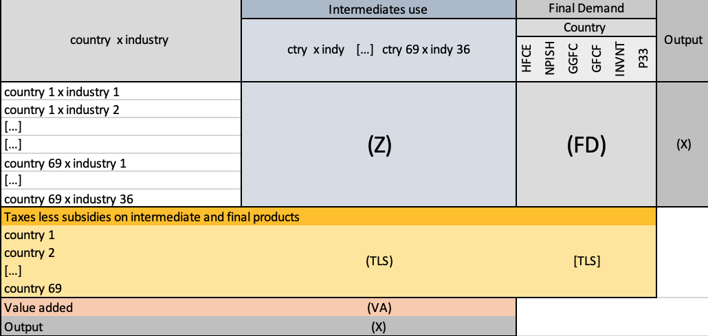
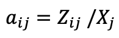
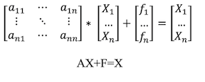
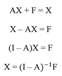
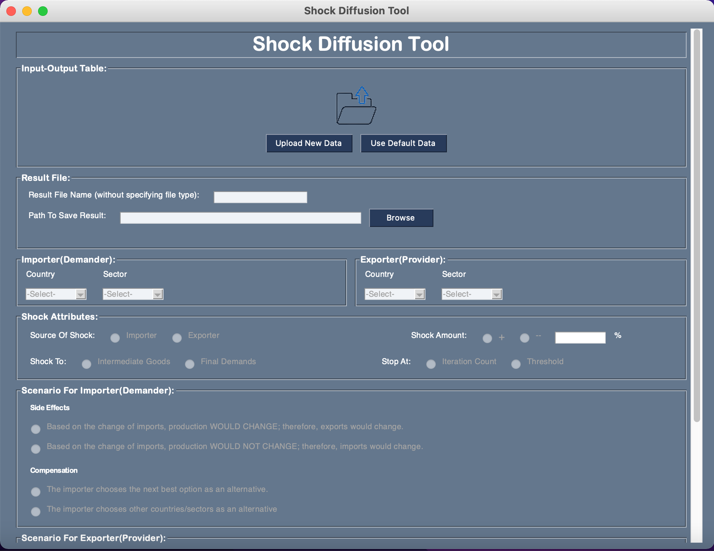

# Shock Diffusion Tool

Implementation of a tool which represents how a shock originating in a country/sector may diffuse among neighboring industries in trade networks. Based on different scenarios stated by the user, the propagation of shock and final network would be different. A demonstration of application and its functionality can be seen [here](https://github.com/m-gheini/BSc-Thesis/blob/master/Thesis.mp4).

- [Shock Diffusion Tool](#shock-diffusion-tool)
  - [Logic behind shock diffusion](#logic-behind-shock-diffusion)
    - [Input-Output(I-O) Table](#input-outputi-o-table)
    - [Leontiff Model](#leontiff-model)
  - [About Tool](#about-tool)
    - [Scenarios Provided in Tool](#scenarios-provided-in-tool)
  - [Implementation](#implementation)
    - [Folders and Files](#folders-and-files)
    - [Libraries](#libraries)
  - [Execution](#execution)
    - [Libraries Installation](#libraries-installation)
    - [Run Code](#run-code)

## Logic behind shock diffusion

It is very important for politicians and economists to know how they should react and what is the best decision based on the on going changes in economic networks among industries. Since using classic Leontief model can be very complex, in this project we would use diffusion process for analysing current changes in economic world. To get to know about logic of diffusion; first we should get familliar with some terms.

### Input-Output(I-O) Table

The input-output (I-O) table is a statistical table developed by American economist Wassily Leontief. The table records the flows of goods and services using the transaction values between industries. It shows for each industry what kinds of products are purchased with what amount as inputs to produce its output (the column perspective), or to which industries / Final Demand sectors the product is supplied for further use (the row perspective).

### Leontiff Model

Leontief used matrices to model economic systems. His models, often referred to as the input-output models, divide the economy into sectors where each sector produces goods and services not only for itself but also for other sectors. These sectors are dependent on each other and the total input always equals the total output. 

This model shows how supply of different sectors change as a result of one unit change in demand of one specific sector. It consists of several steps: 

1. Calculate Technical Coefficients Matrix 
Using technical coefficients we can produce linear equations of trades between sectors. Basically this coefficient states how much input from sector 'i' is needed for sector 'j' to produce one unit of its product. It is calculated as follow(based on I/O table naming provided above):

2. Formulate Technical Coefficients 
We have : 

3. Calculate Leontiff Coefficients 
Using formulated technical coefficients we have below equation, (I-A)-1 is Leontiff coefficients:

## About Tool

The tool has simple gui which makes it easy for user to work with. It is basically a form of needed informations from user. After user entered all of the needed fields and clicking on the start button; the function of diffusiong shock would start. If there was any necessary field empty, a warning would appear on screen. Below you can see the UI of the tool:

### Scenarios Provided in Tool

There four scenarios provided in tool; two of them are Side Effects and other two are for compensation:

- Side Effects
  - Option 1:  
  Based on the change of imports(exports), production WOULD CHANGE; therefore, exports(imports) would change.
  - Option 2:  
  Based on the change of imports(exports), production WOULD NOT CHANGE; therefore, imports(exports) would change.
- Compensation
  - Option 3: 
  The importer(exporter) chooses the next best option as an alternative.
  - Option 4: 
  The importer(exporter) chooses other countries/sectors as an alternative

## Implementation

The code is completely implemented using Python Language. Also Object Oriented design is used for shock diffusion logic. The best version of python to run the code with would be __python3.9__. 

### Folders and Files

Whole project consists of six .py files and two folders named 'Assests' and 'img'. 
- Code Files: 
  1. [updatedDesign.py](https://github.com/m-gheini/BSc-Thesis/blob/master/updatedDesign.py)  
  This file consists of the frontend code of the tool and its user interface. 

  2. [appLogic.py](https://github.com/m-gheini/BSc-Thesis/blob/master/appLogic.py)  
  With this file all the user input in the tool would be saved in a dictionary for further processings. Also all the needed functions in order to update the user interface and get the data from user input IO table is implemented in this file.

  3. [backLogic.py](https://github.com/m-gheini/BSc-Thesis/blob/master/backLogic.py)  
  This file consists of the backend code of the tool and its logic for shock diffusion based on user inputs. 

  4. [network.py](https://github.com/m-gheini/BSc-Thesis/blob/master/network.py)  
  For building economy network based on uploaded IO table by user, this file is imlemented. This file consists of Network, Edges, and Sectors classes and their methods.

  5. [shocks.py](https://github.com/m-gheini/BSc-Thesis/blob/master/shocks.py)  
  This file consists of Shock and ShockManager classes and their methods. Shock class would generate a shock object based on user input and new information during diffusion process. ShockManger class would process the shocks generated and propagate them.

  6. [utility.py](https://github.com/m-gheini/BSc-Thesis/blob/master/utility.py)  
  This file consists of some helping functions. For example the function to create a CSV file for logging shocks information.

- Folders: 
  1. [Assests](https://github.com/m-gheini/BSc-Thesis/tree/master/Assets)  
  This folders consists of some helping files which is needed for running codes or some files which are generated as a result of running code. For example, I_2015.CSV file is default IO table which is used for default choice of tool. shockLog.CSV file is generated after running code and consists of informations about shocks.

  2. [img](https://github.com/m-gheini/BSc-Thesis/tree/master/img)  
  This folder consists images used for preparing this report.

### Libraries

1. [PySimpleGUI](https://pysimplegui.readthedocs.io/en/latest/) 
This library is used in order to implement user interface with python language. This library would generate UI compatible with both Windows and MacOS.

2. [os](https://docs.python.org/3/library/os.html)  
This library is used in order to access files and folder chosen which user was provided as inputs.

3. [math](https://docs.python.org/3/library/math.html)  
This library is used in order to initial some values such as number of shock diffusion iterations with infinity.

4. [pandas](https://pandas.pydata.org)  
This library is used in order to process data and easily process CSV input and output files.

5. [json](https://docs.python.org/3/library/json.html)  
This library is used in order to read from and write to json files. We would save users inputs in a json file.

6. [networkx](https://networkx.org)  
This library is used in order to easily generate economy network based on IO table uploaded by user.

7. [matplotlib.pyplot](https://matplotlib.org/stable/tutorials/introductory/pyplot.html)  
This library is used in order to draw small networks and easily check correcteness of network generated.

8. [csv](https://docs.python.org/3/library/csv.html)  
This library is used in order to work with CSV files. The log files are written to CSV files

## Execution

To execute and run you should first install needed libraries, if not installed. Then based on the part you want to see result from, you should take different steps which is stated in the following.

### Libraries Installation

The Needed libraries are listed [here](#libraries). If these are not installed on your device or installed with the wrong version of python; they must be installed. Becareful about the version of python you are working with, because of networkx python must be __3.7 or higher__. To install them, execute following command in your cmd/terminal: 

`pip3 install package_name`

### Run Code

Based on the part of the code you want to check and see the result from, you should take different steps. Three different scenarios of execution with right steps are listed below: 

1. Check Tool and Its UI 
In order to see the UI you only need to run the `updatedDesign.py` file.

2. Just Check Backend Logic of the Tool and Shock Log 
In this case you should take two steps: 

   - Change the [test.json](https://github.com/m-gheini/BSc-Thesis/blob/master/Assets/test.json) file based on your desired input. Needed inputs mentioned in this file with explaination are listed below: 
      - inputFile 
      The IO table with the right format mentioned [here](#input-outputi-o-table) in picture.
      - outputName 
      The name of the result table after shock diffusion.
      - outputPath 
      The Path to where output file should be saved in.
      - imCountry 
      The importer country.
      - imSector 
      The sector of importer.
      - exCountry 
      The exporter country.
      - exSector 
      The sector of exporter.
      - shockSrc 
      Source of shock. It is one of the importer or exporter countries stated above. So the proper value for this field is "importer" or "exporter".
      - shockSign 
      Sign of the shock. The value of this field could be "+" or "-".
      - shockAmount 
      Amount of shock. The amount should be actually in __percentage__. 
      - shockTo 
      he value of this field should be "intermidiate goods" for now.
      - shockItr 
      The maximum number of iterations for shock diffusion.
      - shockThr 
      The minimum value accepted for shock.
      - imScenario 
      Scenario for importer. The value for this field could be "option1" or "option2" or "option3" or "option4". Options are explained [here](#scenarios-provided-in-tool)
      - exScenario 
      Scenario for exporter. The value for this field could be "option1" or "option2" or "option3" or "option4". Options are explained [here](#scenarios-provided-in-tool)
      - imAlter 
      If "option4" is chosen for imScenario you should prepare a list of alternative sectors with perccentage of alternation.
      Else the value should be "NONE".
      - exAlter 
      If "option4" is chosen for exScenario you should prepare a list of alternative sectors with perccentage of alternation.
      Else the value should be "NONE". 

    - Run `backLogic.py`. Based on the size of the input it may take some time. When finished the shock log could be seen in [shockLog.CSV](https://github.com/m-gheini/BSc-Thesis/blob/master/Assets/shockLog.CSV)
   
3. Check the integration of frontend and backend of the tool(Whole System) 
Run the `updatedDesign.py` file, complete the form and click start.

  

